# LoaderFly

原版程序：https://github.com/knownsec/shellcodeloader

二开作者：Wangfly


## 开发需求

1. 项目已经不免杀了，需要bypass常见杀软。
2. 在HW、攻防演练等场景下，需要快速生成免杀木马，并且保证文件md5都不一样。
3. 节约时间，不用在项目上，投入专门的人员进行代码编写。
4. 高度可拓展和自定义。


## 魔改二开

1. 远程加载将Shellcode和loader分开，loader里面只保留Shellcode的URL地址，方便随时销毁。
2. 加入Hex、Base64（自定义）加密算法，保留原本的流加密算法，以当前时间戳为key，进行对URL加密，将其保存在资源节中。
3. 木马名称随机化，加上流加密算法，使得每次生成的木马md5都不一样。
4. 加入了AES（外部传key）、Base64（自定义）、RC4（自定义）算法加密解密Shellcode。
5. 高危Windows API，全部采用动态加载的方式，能够使用NT函数替换的全部进行了替换，部分模板的函数API进行了UnhookPatch。
6. 针对卡巴斯基、Norton等对内存查杀较严的杀软，采取IAT Hook和VEH Hook对Beacon进行内存加密+配合C2profile的Sleep_mask选项和自定义通信方式基本无解。
7. 针对Norton、360qvm等静态查杀较严的杀软，使用Arkari进行代码混淆。
8. 增强完善了反沙箱、反调试。


## 上线方式

### 64位

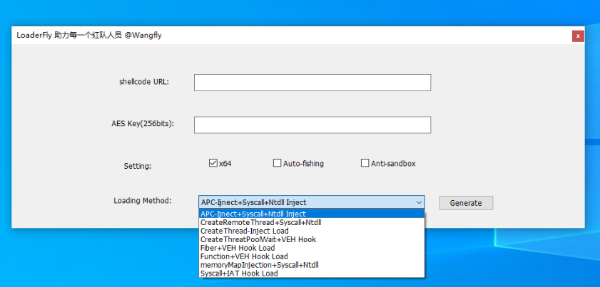


### 32位

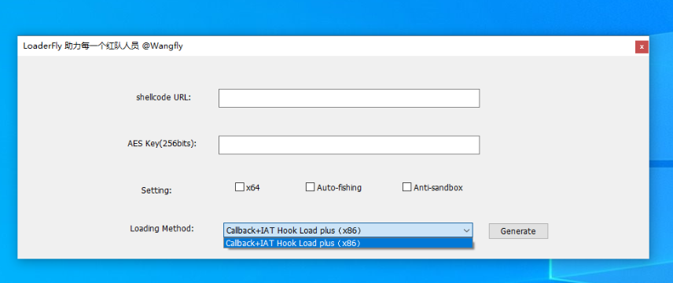


## 编译设置

1. Release进行编译，设置为MT，/arch：x64，生成的文件是**DAT**后缀的。
2. 若你的vs2022有安装集成[Arkari](https://github.com/KomiMoe/Arkari)，那么免杀效果更好，没有的话，普通生成即可。
3. 选择不生成Debug调试信息和清单文件。


## 食用方式

1. 加密Shellcode，选择Stagerless，生成RAW格式。

   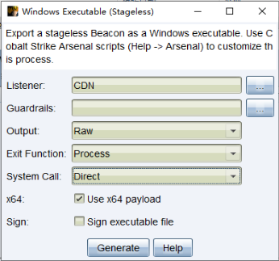


2. 生成的beacon.bin放入程序目录下，然后运行命令加密，AES key可以自定义（256bit）。

   ```shell
   encbin.exe bin文件 AES key
   ```

   

   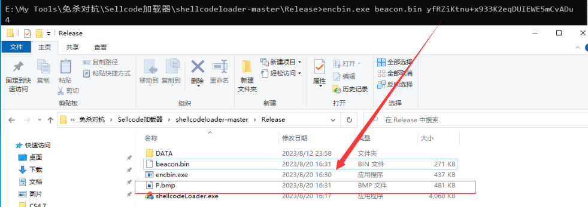

   

   

3. 将P.bmp上传至云端生成链接，**链接必须是访问后，自动下载那种**。

   

   

4. URL填入，AES key填入，选择模板生成即可。

   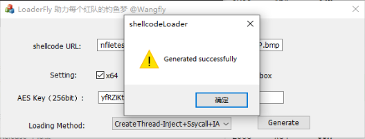


## 整体免杀效果

### 卡巴斯基企业版

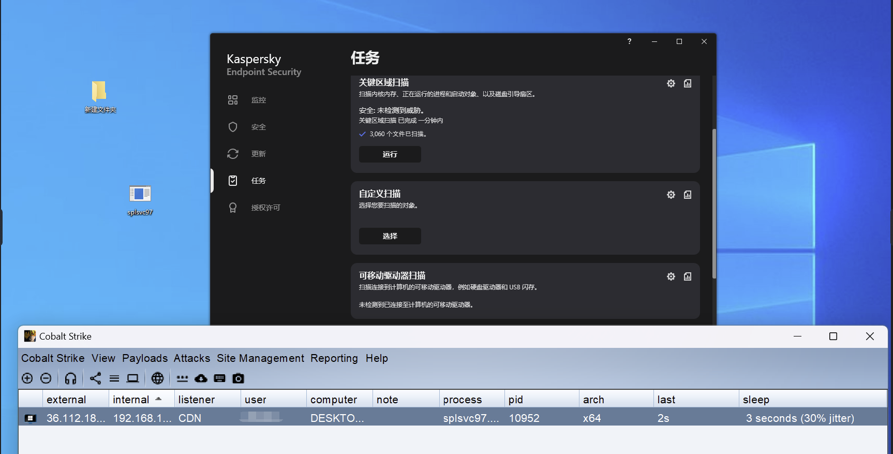


### Norton

启发式查杀很厉害，需要给木马加入正常程序的图标、版本信息、清单、数字签名。必须使用Bof操作，shell运行就掉线。

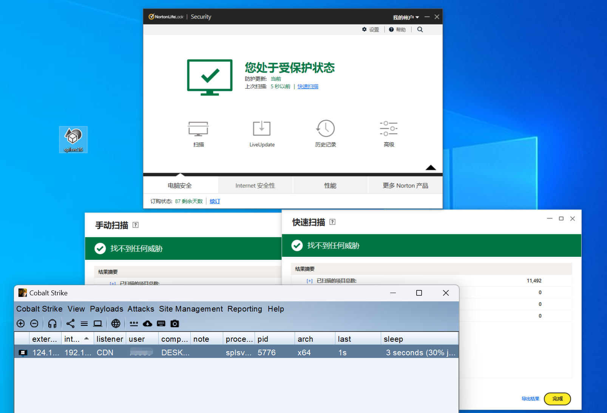


### ESET

自定义扫描了系统内存和桌面文件。

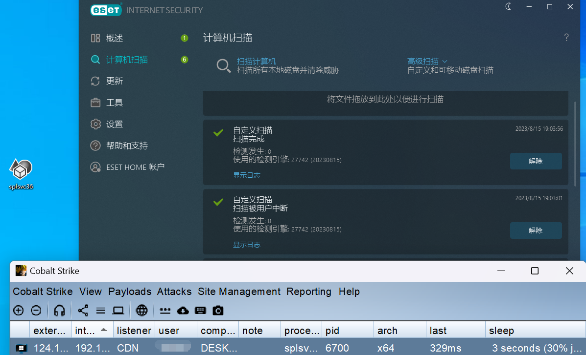


### 360全家桶（物理机）

QVM引擎（很疯狂，大部分时候真不是代码问题）需要做和Norton一样的处理。

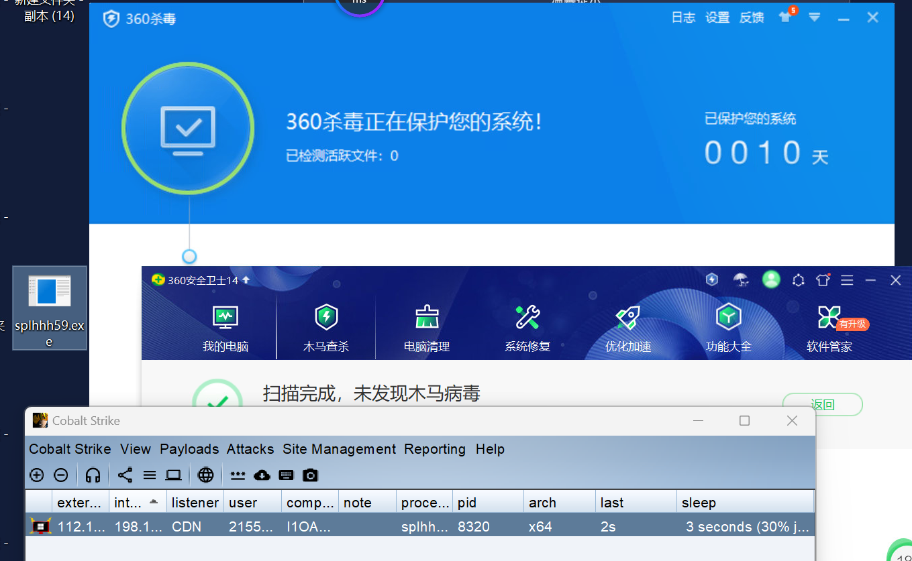


### WDF（2016服务器版本）

运行后会提示你复查，不用管，依旧可以上线。

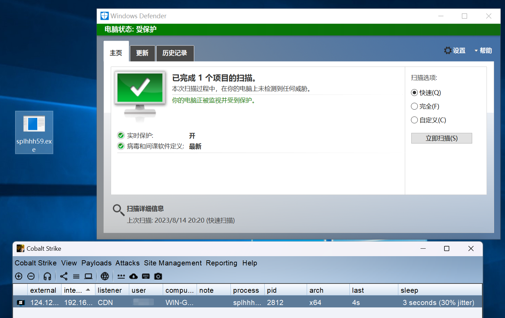


### 火绒+金山

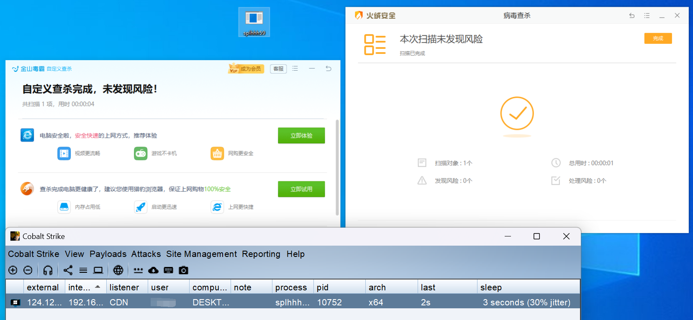


### McAfee

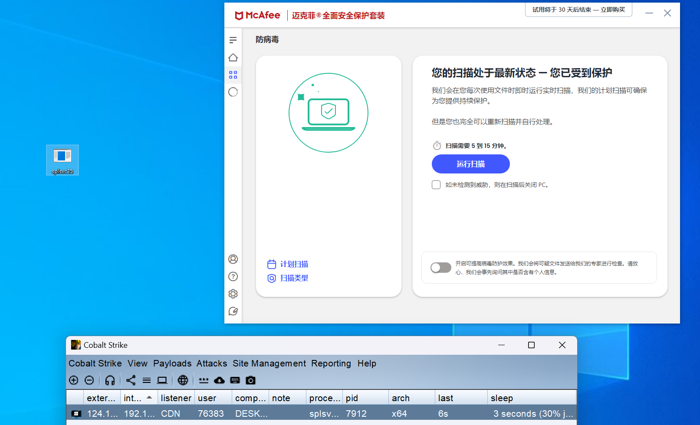


## 单个免杀效果

#### APC-Injetc+Ntdll

**bypass**：金山（数字签名）、火绒、ESET、360全家桶（物理机）、WDF（PC）、McAfee（Adobe程序信息）、卡巴企业版（时间5s 抖动50 Sleep_mask）

**nobypass**：WDF（服务器无法上线）、Norton（静态）

<br>

#### CreateRemoteThread+Syscall+Ntdll Inject

**bypass**：McAfee、火绒、金山（数字签名）、ESET、360全家桶（物理机）、WDF（PC）、卡巴企业版（时间5s 抖动50 Sleep_mask）

**nobypass**：Norton（静态）、WDF（服务器无法上线）

<br>

#### CreateThread-Inject+IAT Hook Inject

**bypass**：McAfee、金山（数字签名）、火绒、ESET、卡巴企业版（时间5s 抖动50 Sleep_mask）、360全家桶（物理机）、Norton（加白程序资源）、WDF（PC）、WDF（Server）、Symantec（加白程序资源）

**nobypass**：

<br>

#### CreateThreatPoolWait+VEH Hook

**bypass**：McAfee、金山（数字签名）、火绒、ESET、卡巴企业版（时间5s 抖动50 Sleep_mask）、360全家桶（物理机）、Norton（加白程序资源）、WDF（PC）、WDF（服务器）

**nobypass**：

<br>

#### Fiber+VEH Hook Load

**bypass**：金山（数字签名）、火绒、ESET、360全家桶（物理机）、WDF（PC）、WDF（服务器提示复查（关云保护））、McAfee、Norton（加白程序资源）、卡巴企业版（时间5s 抖动50 Sleep_mask）

**nobypass**：

<br>

#### NtTestAlert+VEH Hook Load

**bypass**：金山（数字签名）、火绒、ESET、卡巴企业版（时间5s 抖动50 Sleep_mask）、360全家桶（物理机）、WDF（PC）、WDF（服务器提示）、McAfee、Norton（加白程序资源）

**nobypass**：

<br>

#### Syscall+IAT Hook Load

**bypass**：金山（数字签名）、火绒、ESET、卡巴企业版（时间5s 抖动50 Sleep_mask）、360全家桶（物理机）、Norton（加白程序资源）、WDF（PC）、WDF（服务器）、McAfee

**nobypass**：

<br>

#### Callback+IAT Hook Load plus（x86）

**bypass**：360全家桶（物理机）、WDF（PC）、ESET、金山（数字签名）、火绒、WDF（服务器提）、McAfee、卡巴企业版

**nobypass**：Norton（静态）

<br>

#### memoryMapInjection+Syscall+Ntdll

**bypass**：360全家桶（物理机）、WDF（PC）、ESET、金山（数字签名）、火绒、WDF（服务器）、McAfee、卡巴企业版（时间5s 抖动50 Sleep_mask）

**nobypass**：Norton（静态），WDF（服务器）

<br>

#### Function+VEH Hook Load

**bypass**：卡巴企业版、ESET、McAfee、金山（数字签名）、火绒、360全家桶（物理机）（数字签名+版权信息+清单+图标（可有可无））、WDF（PC）、ESET

**nobypass**：Norton（静态）


## 版本迭代

### 1.0版本

1. 删除部分无效加载器模板。
2. 完成预定的魔改需求。


### 2.0版本

1. APC注入加载器中增加虚假父进程功能。
2. 增加钓鱼模式，有弹窗事件产生和鼠标移动检测。
3. 改进APC-Injetc+UnhookingPatch、CreateRemoteThread+Syscall Inject、CreateThread-Inject+IAT Hook Inject三种加载模板。


### 3.0版本

1. 修复APC-Injetc+UnhookingPatch、CreateRemoteThread+Syscall Inject父进程句柄继承问题、加入重载Ntdll.dll功能，清除EDR挂钩。
2. UI界面增大，看着更舒服。
3. 继续修改Dynamic+IAT Hook Load plus（x86），加入回调函数机制，重命名为Callback+IAT Hook Load plus（x86）,实现bypass卡巴。
4. 修改框架输入，实现输入一个URL即可生成。


### 4.0版本

1. 增加memoryMapInjection+Syscall+Ntdll、Function+VEH Hook Load两个模板。
2. 删除失效报毒的反沙箱、调试代码。

3. 减少解密算法冗余。
4. 自定义AES KEY传入，提升快速免杀能力。
5. 修改生成器的缓冲区bug。


### 5.0版本（开源）

1. APC-Injetc+Ntdll进行改进使用NT函数进行APC注入，bypass卡巴动态。
1. 增加随机AES Key。


## 注意事项

1. **未经授权不要拿去做违法事情，若出事任何事情与本人无关。**
2. 大部分代码已经开源，但模板只给了一个APC注入的阉割版，以供学习参考。
3. 可以根据已有的模板和原作者的项目进行拓展开发。
